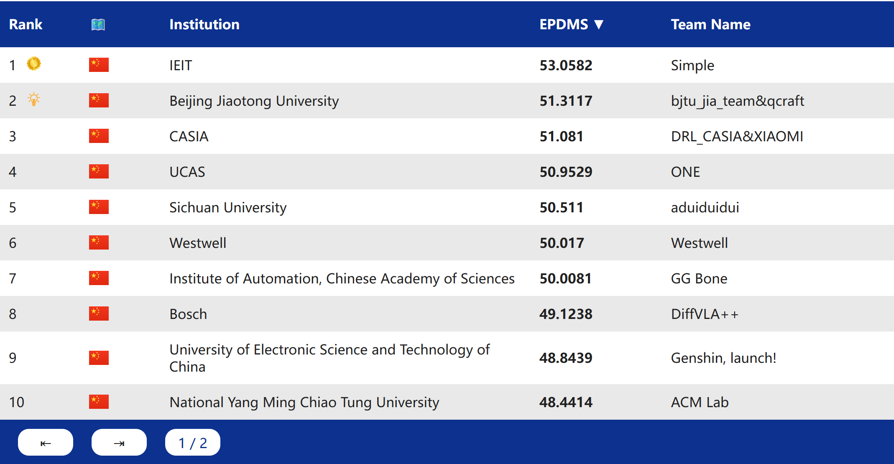
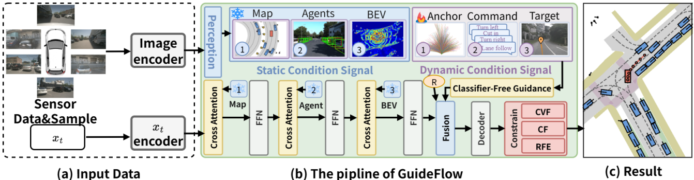
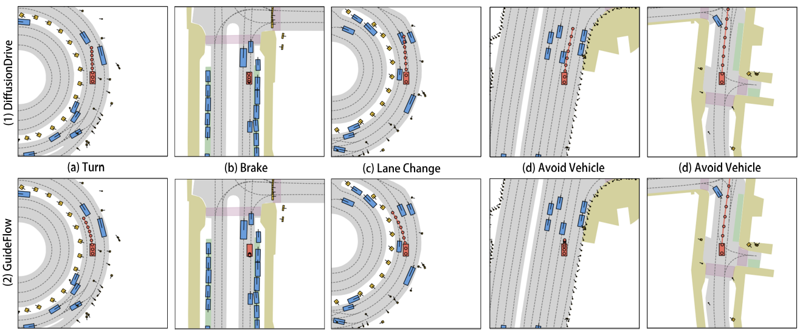
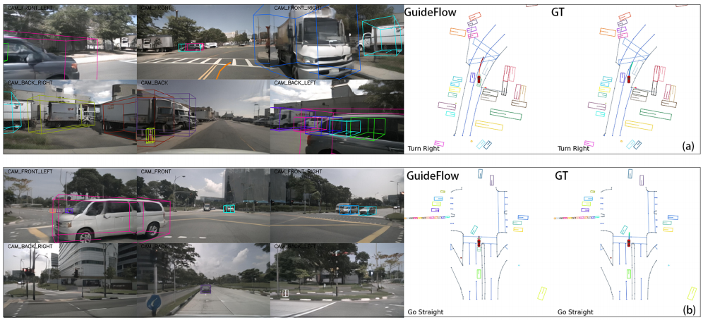
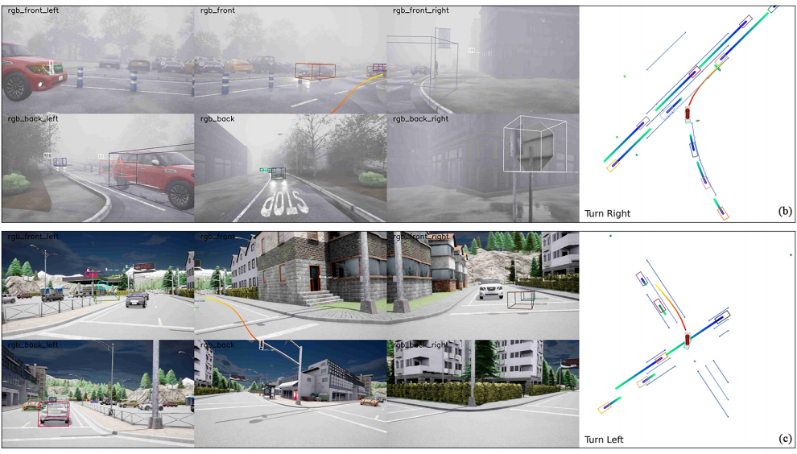

<div align="center">
<h1>GuideFlow</h1>
<h3>GuideFlow: Constraint-Guided Flow Matching for Planning in End-to-End
Autonomous Driving</h3>

Lin Liu `<sup>`1,2 `</sup>`, Caiyan Jia `<sup>`1,2*`</sup>`, Guanyi Yu `<sup>`3,†`</sup>`, Ziying Song `<sup>`1,2*`</sup>`,
JunQiao Li `<sup>`3 `</sup>`, Feiyang Jia `<sup>`1 `</sup>`,Peiliang Wu `<sup>`1 `</sup>`, Xiaoshuai Hao `<sup>`5 `</sup>`, Yandan Luo `<sup>`5 `</sup>`
`<sup>`1 `</sup>` School of Computer Science and Technology, Beijing Jiaotong University
`<sup>`2 `</sup>` Beijing Key Laboratory of Traffic Data Mining and Embodied Intelligence
`<sup>`3 `</sup>` Qcraft,  `<sup>`4 `</sup>` Yanshan University
`<sup>`5 `</sup>` Institute of Information Engineering, Chinese Academy of Sciences
`<sup>`6 `</sup>` The University of Queensland

`<sup>`*`</sup>` corresponding author | †Project Lead

[](https://opensource.org/licenses/Apache-2.0)

<div align="center">
<b>Overall architecture of GuideFlow. </b>

</div></div>

## News


* **` Feb. 21th, 2026`:** **We released our code in navsim!**
* **` Nov. 24th, 2025`:** We released our paper on [Arxiv](https://arxiv.org/pdf/2511.18729)!.
* **` Oct. 9th, 2025`:** **GuideFlow received 2nd and the Innovation Award during the Autonomous Grand Challenge 2025 !**.

## Links

- [Introduction](#introduction)
- [Qualitative Results on Navhard]()
- [Getting Started]()
- [Model Zoo on NavSimV2]()
- [Acknowledgement](#Acknowledgement)
- [Citation](#Citation)

## Introduction

Driving planning is a critical component of end-to-end (E2E) autonomous driving. However, prevailing Imitative E2E Planners often suffer from multimodal trajectory mode collapse, failing to produce diverse trajectory proposals. Meanwhile, Generative E2E Planners struggle to incorporate crucial safety and physical constraints directly into the generative process, necessitating an additional optimization stage to refine their outputs. In this paper, we propose GuideFlow, a novel planning framework that leverages Constrained Flow Matching. Concretely, GuideFlow explicitly models the flow matching process, which inherently mitigates mode collapse and allows for flexible guidance from various conditioning signals. Our core contribution lies in directly enforcing explicit constraints within the flow matching generation process, rather than relying on implicit constraint encoding. Crucially, GuideFlow unifies the training of the flow matching with the Energy-Based Model (EBM) to enhance the model’s autonomous optimization capability to robustly satisfy physical constraints. Secondly, GuideFlow parameterizes driving aggressiveness as a control signal during generation, enabling precise manipulation of trajectory style. Extensive evaluations on major driving benchmarks (Bench2Drive, NuScenes, NavSim and ADV-NuScenes) validate the effectiveness of GuideFlow. Notably, on the NavSim test hard split (Navhard), GuideFlow achieved SOTA with an EPDMS score of 43.0.

<div align="center">
<b>Overall architecture of GuideFlow. </b>

</div>

## Qualitative Results on NAVSIM, NuScenes and Bench2Drive

<div align="center">
  <b>Qualitative Results on NAVSIM.</b>
  
  <b>Qualitative Results on NuScenes.</b>
  
  <b>Qualitative Results on Bench2Drive.</b>
  
</div>

## Getting Started

- [Getting started from NAVSIM environment preparation](https://github.com/autonomousvision/navsim?tab=readme-ov-file#getting-started-)Training & Evaluation

  Update paths in:

  ```
  ——navsim/agents/WoTE/configs/default_stage1.py
  ——navsim/agents/WoTE/configs/default_stage2.py
  ——navsim/agents/WoTE/configs/default_stage3.py
  ```

  ## Then launch training stage 1:


  ```bash
  bash scripts/training/run_ImagineWorld_stage1.sh # stage1_training
  ```

  Then launch training stage 2:

  ```bash
  bash scripts/training/run_ImagineWorld_stage2.sh # stage2_training
  ```

  Then launch training stage 3:

  ```bash
  bash scripts/training/run_ImagineWorld_stage3.sh # stage3_training
  ```

  Evaluation (stage 3):

  ```bash
  bash scripts/evaluation/eval_driveworld_vla.sh
  ```

## Training & Evaluation

Train GuideFlow on Navtrain split

```bash
bash ./scripts/training/run_flowdrive_training.sh
```

Test GuideFlow on Navhard split

```bash
bash ./scripts/testing/test_flow.sh
```

***The model type:***

```bash
flowdrive_unet/transfuser_model_v3.py # anchor as condition
flowdrive_unet/transfuser_model_v4.py # anchor as condition with meanflow
flowdrive_unet/transfuser_model_v5.py # command as condition
flowdrive_unet/transfuser_model_v6.py # command as condition
flowdrive_unet/transfuser_model_v9.py # command + EP SCORE as condition
flowdrive_unet/transfuser_model_v10.py # command + EP SCORE as condition + rfe Module
```

## Acknowledgement

GuideFlow is greatly inspired by the following outstanding contributions to the open-source community: [NAVSIM](https://github.com/autonomousvision/navsim), [DiffusionDrive](https://github.com/hustvl/DiffusionDrive), [GTRS](https://github.com/NVlabs/GTRS).

## Model Zoo

| Split           | EPDMS | Results                               |
| --------------- | ----- | ------------------------------------- |
| Private NavHard | 49.44 | [link](./assets/submission_49.44.pkl)    |
| Private NavHard | 49.66 | [link](./assets/submission_49.66.pkl)    |
| Private NavHard | 50.01 | [link](./assets/submission_50.01.44.pkl) |
| Private NavHard | 50.20 | [link](./assets/submission_50.20.pkl)    |
| Private NavHard | 50.60 | [link](./assets/submission_50.60.pkl)    |
| Private NavHard | 51.31 | [link](./assets/submission_51.31.44.pkl) |

## More from Us

If you're interested in **E2E methods** for autonomous driving, or looking for a world model codebase on NAVSIM, feel free to check out our other works: [MomAD](https://arxiv.org/abs/2503.03125), [Diver](https://arxiv.org/abs/2503.03125), [DriveWorld-VLA](https://arxiv.org/abs/2602.06521)

## Citation

If you find GuideFlow is useful in your research or applications, please consider giving us a star 🌟 and citing it by the following BibTeX entry.

```bibtex
@misc{liu2025guideflowconstraintguidedflowmatching,
      title={GuideFlow: Constraint-Guided Flow Matching for Planning in End-to-End Autonomous Driving}, 
      author={Lin Liu and Caiyan Jia and Guanyi Yu and Ziying Song and JunQiao Li and Feiyang Jia and Peiliang Wu and Xiaoshuai Hao and Yandan Luo},
      year={2025},
      eprint={2511.18729},
      archivePrefix={arXiv},
      primaryClass={cs.CV},
      url={https://arxiv.org/abs/2511.18729}, 
}
```

</div>
